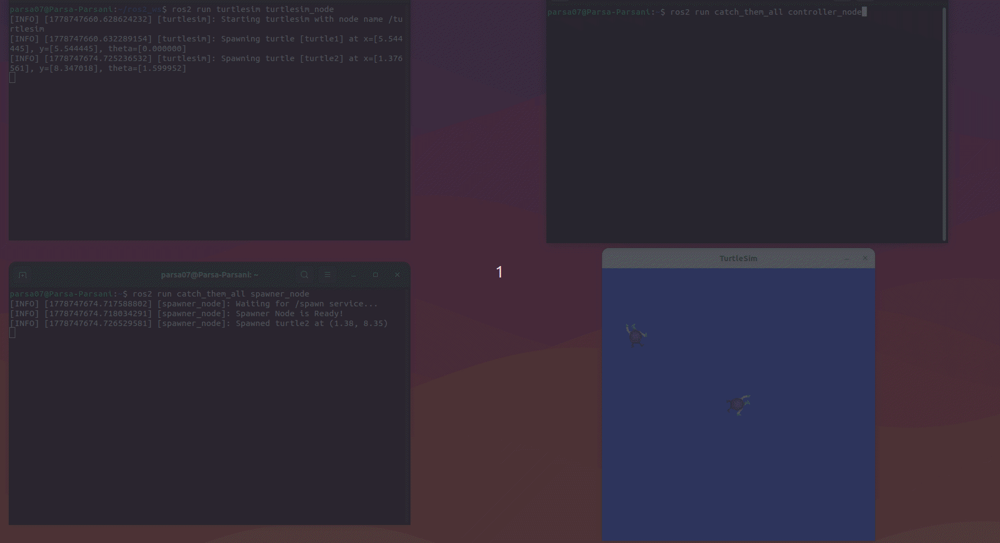
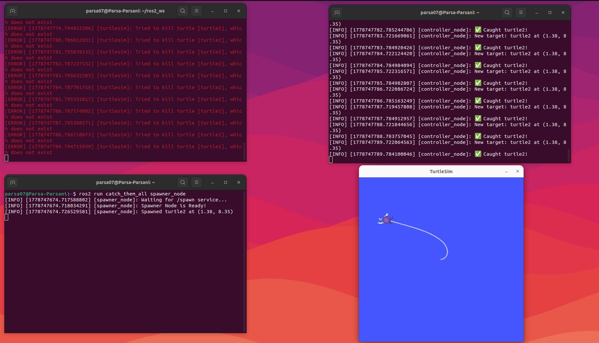

# 🐢 Catch Them All — ROS 2 Autonomous Turtle Catcher



An autonomous multi-node ROS 2 project that uses **Proportional (P) Control** to chase and catch randomly spawned turtles in Turtlesim — no keyboard, pure math!

---

## 📸 Screenshot



---

## 🧠 How It Works

| Node | Role |
|------|------|
| 🐢 **Spawner Node** | Randomly spawns target turtles and broadcasts their position |
| 🎯 **Controller Node** | Uses P control to autonomously drive the main turtle to catch targets |

### The Math Behind It
- **Euclidean Distance** → how far is the target?
- **atan2** → what angle should I turn?
- **Proportional Control** → the farther the target, the faster we move

---

## 🛠️ Built With
- ROS 2 Humble/Jazzy
- Python 3
- Turtlesim
- Proportional (P) Control

---

## 🚀 How To Run

### 1. Build the package
```bash
cd ~/ros2_ws
colcon build --packages-select catch_them_all
source ~/ros2_ws/install/setup.bash
```

### 2. Terminal 1 — Start Turtlesim
```bash
ros2 run turtlesim turtlesim_node
```

### 3. Terminal 2 — Start Spawner
```bash
ros2 run catch_them_all spawner_node
```

### 4. Terminal 3 — Start Controller
```bash
ros2 run catch_them_all controller_node
```

---

## 📌 Key Concepts
- ✅ Euclidean distance calculation
- ✅ Proportional control loop
- ✅ Async service calls
- ✅ ROS 2 Publishers & Subscribers
- ✅ Multi-node architecture

---

## 👤 Author
**Parsa Farsani** — [@PYF07](https://github.com/PYF07)
